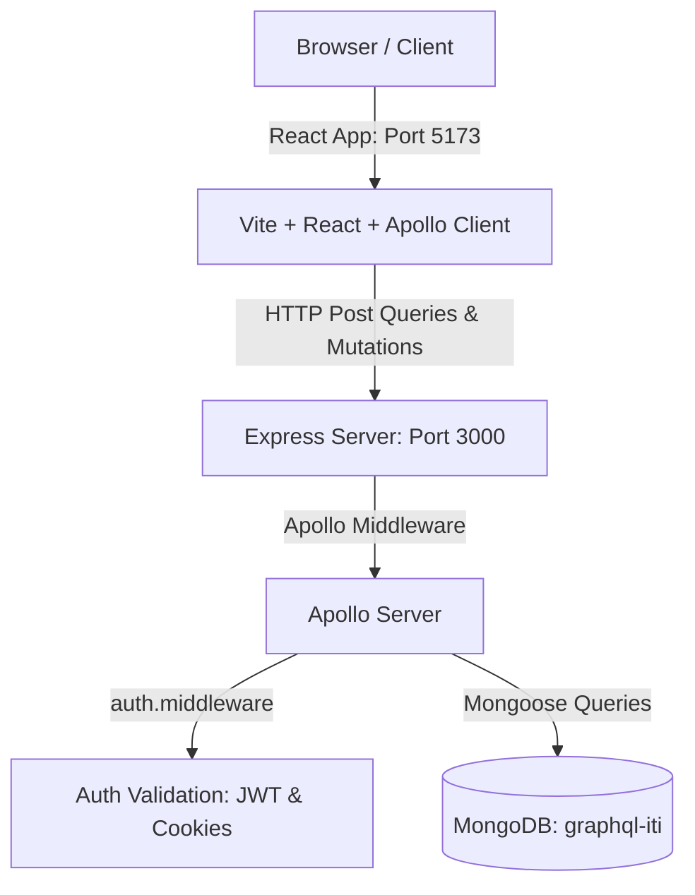

# AURA - Modern Social Feed Application

AURA is an elegant, responsive social feed platform built using a modern **React & TypeScript** frontend and a **GraphQL & MongoDB** backend. The interface is inspired by Instagram's design layout, styled with a premium, soothing **Midnight Matcha** dark theme.

---

## 🏗️ Architecture Overview

The workspace is structured as a monorepo consisting of two distinct modules orchestrated from the project root:



### Directory Structure

```text
├── backend/                  # GraphQL Backend Server
│   ├── middlewares/          # JWT Cookie & Header Auth Interceptor
│   ├── models/               # Mongoose Schemas (User, Post, Comment)
│   ├── schema/               # GraphQL TypeDefs & Mutation/Query Resolvers
│   ├── app.ts                # Main Express & Apollo initialization
│   ├── db.connection.ts      # Database connection handler
│   └── tsconfig.json         # TypeScript compiler configurations
│
├── frontend/                 # React Frontend Client
│   ├── src/
│   │   ├── components/       # UI Components (AuthCard, PostCard, CommentSection)
│   │   ├── apollo-client.ts  # Apollo Client configuration (Credentials + Header Auth)
│   │   ├── App.tsx           # Coordinate Views & Main Layout
│   │   └── index.css         # "Midnight Matcha" Custom CSS variables & styles
│   └── vite.config.ts        # Vite configuration
│
├── package.json              # Workspace script runner orchestrator
└── README.md                 # Project documentation
```

---

## 🌟 Key Features

### 1. Instagram-Inspired Layout
* **Desktop фиксированный Sidebar**: A fixed left-hand navigation column (width `240px`) containing the AURA branding, feed navigation links, create buttons, and logout actions.
* **Mobile Bottom Nav**: Collapses automatically on screen widths below `768px` into an absolute bottom bar containing Home, Create, and Log Out buttons.
* **Centered Main Feed**: Feeds are locked to a clean, focused `470px` width (Instagram standard) for optimal reading experience.
* **Create Post Modal**: Opens in a blurred backdrop modal overlay, keeping the feed space clean.

### 2. Dual-Mode Authentication (Secure & Robust)
* The `checkAuth` middleware automatically inspects and resolves sessions via:
  1. **HTTP-only Cookies**: Seamless, automated browser session management.
  2. **Authorization Headers**: Fallback support (`Bearer <token>`) to bypass cross-origin browser constraints in development sandboxes (like Apollo Studio).

### 3. Comprehensive CRUD & Relationship Queries
* Full operations on **Users, Posts, and Comments**.
* Graph relation links automatically load authors and comment lists recursively via Mongoose without requiring client-side population loops.
* Protected routes (editing posts, deleting posts, or deleting comments) verify permissions before committing updates to the database.

### 4. Midnight Matcha Palette
* Deep forest green background (`#090e0c`)
* Dark sage card container surfaces (`#121815`)
* Warm vanilla/cream highlights (`#f4efe2`)
* Pastel mint accents (`#86efac`)
* Styled with the modern, geometric `Quicksand` font family.

---

## 🚀 Getting Started

### Prerequisites
* **Node.js** (v20+ recommended)
* **MongoDB** (running locally on default port `27017`)

### Installation & Development
Clone the repository, configure the settings, and start the development servers:

1. **Install workspace dependencies**:
   ```bash
   npm run install-all
   npm install
   ```

2. **Configure environment settings**:
   Verify or update the configuration inside `backend/.env`:
   ```env
   PORT=3000
   DATABASE_URI=mongodb://localhost:27017/graphql-iti
   SECRET=your_jwt_signing_key_phrase
   ```

3. **Start the applications**:
   From the project root folder, run:
   ```bash
   npm run dev
   ```
   *This starts the GraphQL backend (port 3000) and the React web app (port 5173) concurrently in a single terminal.*

4. **Navigate**:
   * Open the frontend: **[http://localhost:5173/](http://localhost:5173/)**
   * Inspect the API playground: **[http://localhost:3000/graphql](http://localhost:3000/graphql)**

---

## 🛠️ Production Build

To compile TypeScript and output optimized production bundles:

```bash
npm run build
```
* Built backend files are generated under `backend/dist/`.
* Built frontend files are generated under `frontend/dist/`.
